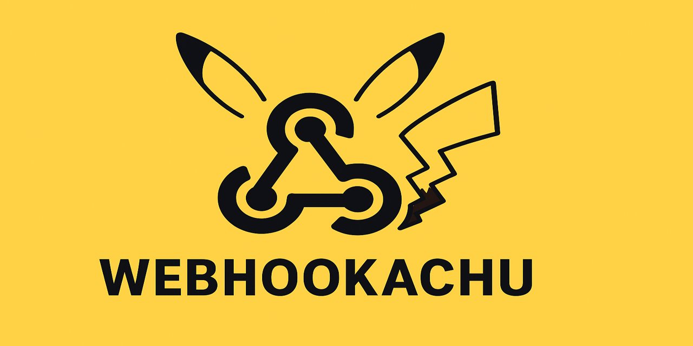

# Webhookachu

**Webhookachu** is a lightweight application that helps you receive, inspect, and test webhooks.

If you're working with integrations, automation, or any systems that send data to a URL — this tool lets you catch, log, and analyze those incoming webhook requests with ease.

---

## 🎯 What it's for

- Viewing and filtering webhook payloads,
- Testing your own webhook integrations before going live,
- A simple starting point for exploring how webhooks work — locally or in the cloud.

---

## 💡 Who it's for

For developers, integrators, QA engineers, DevOps, and anyone who needs a place to catch and inspect webhook requests.

---

> `Webhookachu` – because every webhook deserves to be caught ⚡
